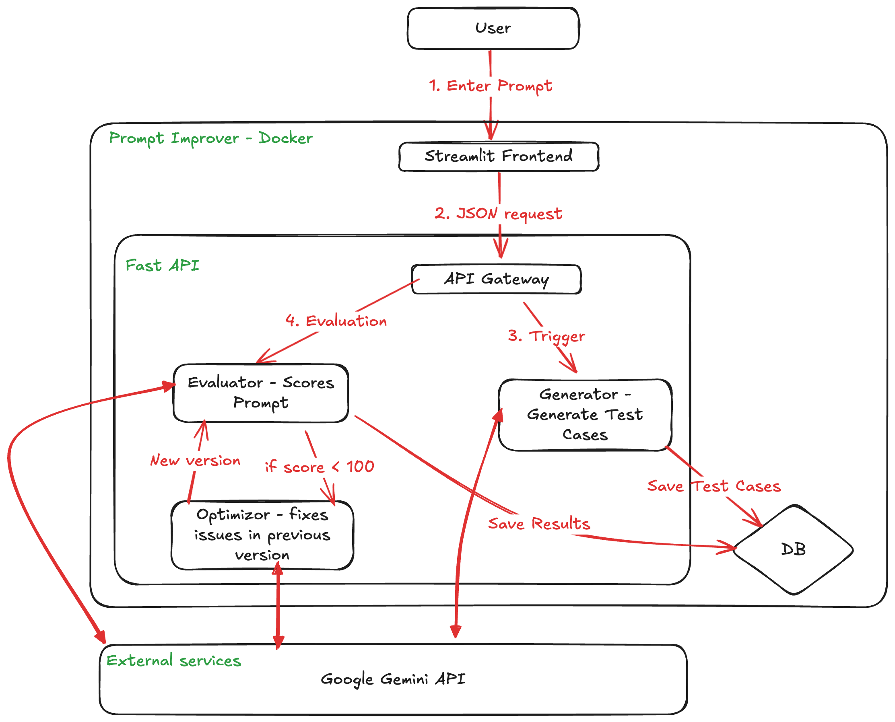

# Prompt Improver

An intelligent system that automatically improves AI prompts by evaluating their performance and iteratively optimizing them. Built with FastAPI, Streamlit, and Google's Gemini AI.

**[Try the live demo on HuggingFace Spaces](https://huggingface.co/spaces/zayeem11511/prompt-improver)**

## What It Does

Prompt Improver is designed to help you create better prompts through a data-driven approach:

1. **Define Your Task** - Start with an initial prompt template
2. **Generate Test Cases** - Automatically create synthetic test data
3. **Evaluate Performance** - Run your prompt against test cases and measure results
4. **Optimize** - Use AI to generate improved versions of your prompt
5. **Compare Results** - See the improvements side-by-side

Instead of manually tweaking prompts, this tool uses AI to understand what's failing and suggests evidence-based improvements.

## Features

- **Automated Prompt Optimization** - AI-powered suggestions based on actual performance data
- **Performance Evaluation** - Score prompts on real test cases
- **Synthetic Data Generation** - Create diverse test cases automatically
- **Version History** - Track all prompt iterations and their scores
- **Smart Variables** - Support for templated prompts with dynamic inputs
- **Persistent Storage** - All projects and results stored in SQLite
- **Web UI** - User-friendly Streamlit interface
- **REST API** - Integrate with your own applications

## Quick Start

### Prerequisites

- Python 3.8+
- Google Gemini API key ([Get one free here](https://makersuite.google.com/app/apikey))

### Installation

1. **Clone and setup:**
   ```bash
   cd prompt-improver
   ```

2. **Install dependencies:**
   ```bash
   pip install -r requirements.txt
   ```

3. **Configure environment:**
   ```bash
   # Create a .env file
   echo "GEMINI_API_KEY=your_api_key_here" > .env
   ```

4. **Run the application:**
   ```bash
   bash start.sh
   ```

   This starts:
   - **Backend API**: http://localhost:8000 (FastAPI)
   - **Frontend UI**: http://localhost:7860 (Streamlit)

5. **Open in browser:**
   Visit `http://localhost:7860` to start improving prompts

## How It Works



### The Optimization Loop

```
Initial Prompt
    ↓
Generate Test Cases
    ↓
Evaluate Against Tests
    ↓
Analyze Failures
    ↓
Generate Improved Prompt
    ↓
Compare & Store Results
```

### Example Workflow

1. **Create a Project**: Enter your initial prompt (e.g., "Summarize this article: {{article}}")
2. **Generate Data**: System creates test cases with various article types
3. **Run Evaluation**: Your prompt is tested against all cases, scores recorded
4. **Optimize**: AI analyzes failures and suggests improvements
5. **Review Results**: Compare original vs improved prompt performance

## Project Structure

```
prompt-improver/
├── app.py              # Streamlit web interface
├── api.py              # FastAPI backend endpoints
├── database.py         # SQLAlchemy ORM models & setup
├── generator.py        # Synthetic test case generation
├── optimizer.py        # Prompt optimization logic
├── evaluator.py        # Evaluation & scoring engine
├── requirements.txt    # Python dependencies
├── start.sh            # Start both services
├── Dockerfile          # Docker configuration
├── test_cases.json     # Sample test case format
└── prompt_history.db   # SQLite database (created on first run)
```

## API Endpoints

### Create a Project
```bash
POST /create_project
{
  "initial_prompt": "Summarize this article: {{article}}"
}
```

### Get Prompt Version
```bash
GET /get_prompt?slug=project_slug
```

### Generate Test Cases
```bash
POST /generate_data
{
  "slug": "project_slug",
  "num_cases": 5
}
```

### Optimize Prompt
```bash
POST /optimize
{
  "slug": "project_slug"
}
```

## Configuration

Set these environment variables in `.env`:

```env
GEMINI_API_KEY=your_api_key_here
DB_FOLDER=.              # Where to store the SQLite database
```

## Requirements

- **fastapi** - Web framework for the backend API
- **uvicorn** - ASGI server to run FastAPI
- **streamlit** - Frontend web UI framework
- **sqlalchemy** - ORM for database management
- **pydantic** - Data validation
- **google-generativeai** - Google Gemini API client
- **pandas** - Data manipulation
- **requests** - HTTP client
- **python-dotenv** - Environment variable management

## Docker Support

Build and run with Docker:

```bash
docker build -t prompt-improver .
docker run -p 7860:7860 -p 8000:8000 -e GEMINI_API_KEY=your_key prompt-improver
```

## Development

### Running Tests
```bash
python -m pytest
```

### Logs

The application logs all optimization activities. Check the terminal output for details on:
- Prompt evaluations
- Generation progress
- API requests
- Database operations

## Troubleshooting

**"API request failed"**
- Ensure the backend is running (check http://localhost:8000/docs)
- Check your internet connection

**"Invalid GEMINI_API_KEY"**
- Get a valid API key from [Google AI Studio](https://makersuite.google.com/app/apikey)
- Ensure it's set in your `.env` file

**Database locked**
- Close other connections to `prompt_history.db`
- Try deleting the database file to start fresh

## How Prompts Are Optimized

The optimizer works by:

1. **Analyzing Failures** - Identifies which test cases failed and why
2. **Understanding Context** - Examines the input, expected output, and actual output
3. **Generating Alternatives** - Uses Gemini to suggest improved prompt wording
4. **Maintaining Variables** - Ensures all required variables are preserved
5. **Scoring New Versions** - Tests improvements against the same test cases

Each improvement is documented with a rationale explaining what changed and why.

## Example Use Cases

- **Customer Support** - Optimize prompts for categorizing support tickets
- **Content Generation** - Improve prompts for writing product descriptions
- **Data Extraction** - Refine prompts for extracting structured data from text
- **Code Generation** - Enhance prompts for generating code snippets
- **Summarization** - Perfect prompts for summarizing documents or articles

## Contributing

Have ideas for improvements? Feel free to:
1. Test the current prompts and share results
2. Suggest new optimization strategies
3. Improve test case generation
4. Enhance the UI/UX

## License

MIT License - Feel free to use this in your projects!

## Support

For issues, questions, or feature requests, please open an issue on the project repository.

---

**Built with** love using FastAPI, Streamlit, and Google Gemini
